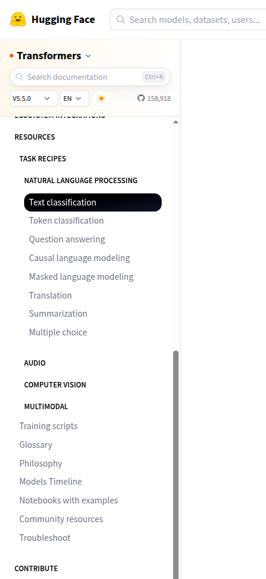

## Large Language Models (LLMs)

**Large Language Models (LLMs)** are a powerful subset of deep neural NLP models characterized by:

1. massive size (billions of parameters)
2. extensive training data (trillions of tokens)
3. ability to perform a wide range of language tasks

## Terminology

* **Architecture:** The model's skeleton (e.g., BERT).
* **Checkpoint:** The specific saved weights (e.g., `bert-base-cased`).
* **Model:** Umbrella term for both.

## Transfer Learning

**Transfer learning** is reusing a trained model on a new, related problem.

1. **Pretraining:** self-supervised training on trillions of tokens datasets.
  - No specific task other than completing missing text.
  - Result: word "meaning", grammar, common phrases, references, and other language features ..etc.
2. **Fine-tuning:** supervised training on dataset with text targets
   - Result: when prompted for a task, completes the task (e.g., answer questions or write code)

Why Transfer learning? - It's dramatically much more economical, data and compute efficient, as well as environmentally friendly, than training a model from scratch.

## Example: QARI-OCR

[QARI-OCR](https://huggingface.co/NAMAA-Space/Qari-OCR-v0.3-VL-2B-Instruct) is a Vision-language Model (VLM) fine-tuned from `Qwen2-VL-2B-Instruct` to process Arabic documents. Key Features:

- 📐 **Layout-Aware Recognition**: Preserves document structure with HTML/Markdown tags
- 🔤 **Full Diacritics Support**: Accurate recognition of tashkeel (Arabic diacritical marks)
- 📝 **Multi-Font Handling**: Trained on 12 diverse Arabic fonts (14px-100px)
- 🎯 **Structure-First Design**: Optimized for documents with headers, body text, and complex layouts
- ⚡ **Efficient Training**: Only 11 hours on single GPU with 10k samples
- 🖼️ **Robust Performance**: Handles low-resolution and degraded images

### QARI-OCR Model Performance

| Metric                         | Score       |
| ------------------------------ | ----------- |
| **Character Error Rate (CER)** | 0.300       |
| **Word Error Rate (WER)**      | 0.485       |
| **BLEU Score**                 | 0.545       |
| **Training Time**              | 11 hours    |
| **CO₂ Emissions**              | 1.88 kg eq. |

### QARI-OCR Training Details

- **Base Model**: Qwen2-VL-2B-Instruct
- **Training Data**: 10,000 synthetic Arabic documents with HTML markup
- **Optimization**: 4-bit LoRA adapters (rank=16)
- **Hardware**: Single NVIDIA A6000 GPU (48GB)
- **Framework**: Unsloth + Hugging Face TRL

## How to train?.. Task Recipes

Wondering how to fine-tune a **model** on a specific **dataset**? checkout the recipes on the left in transformers docs. Example task: [ASR](https://huggingface.co/docs/transformers/tasks/asr).

{fig-align="left"}


## LLM Inference

**Inference** is the process of using a trained LLM to generate human-like text from a given input prompt.

A LLM is trained to generate the next word (token) given some initial text (prompt) along with its own generated outputs up to a predefined length or when it reaches an end-of-sequence (`EOS`) token.

## Transformer LLMs are multi-taskers

Easily switch between models or tasks, as long as the architecture is supported for a given task.

## Same model, different tasks

For example, the same model can be used for separate tasks.

```py
from transformers import pipeline

# use the same API for 3 different tasks
checkpoint = "meta-llama/Llama-2-7b-hf"

answerer = pipeline("question-answering", model=checkpoint)
classifier = pipeline("sentiment-analysis", model=checkpoint)
generator = pipeline("text-generation", model=checkpoint)
```

## Same task, different models

You may want to quickly try out several different models for a task.

```py
from transformers import pipeline

# Task remains "text-generation", models change
llama = pipeline("text-generation", model="meta-llama/Llama-2-7b-hf")
mistral = pipeline("text-generation", model="mistralai/Mistral-7B-v0.1")
gemma = pipeline("text-generation", model="google/gemma-7b")
```

## How LLMs actually generate text?

Two phases:

1. **Prefill**
   1. Tokenization
   2. Embedding
   3. Processing
2. **Decode**
   1. Attention
   2. Probability
   3. Selection
   4. Check

### Phase 1: Prefill

The prefill phase is like the preparation stage in cooking - it's where all the initial ingredients are processed and made ready. This phase involves three key steps:

1. **Tokenize**: identify input as segmented parts.
2. **Embed**: map to corrresponding vectors.
3. **Feed Forward**: run the vectors through the neural network. 

Computationally intensive: think of it as reading the entire text word-for-word each time, before starting to write the next word.

You can experiment with different tokenizers (first step in this phase) in the interactive playground below:

<iframe
	src="https://agents-course-the-tokenizer-playground.static.hf.space"
	frameborder="0"
	width="850"
	height="450"
></iframe>


## The Role of Attention

The attention mechanism is what gives LLMs their ability to understand context and generate coherent responses. When predicting the next word, not every word in a sentence carries equal weight - for example, in the sentence *"The capital of France is ..."*, the words "France" and "capital" are crucial for determining that "Paris" should come next. This ability to focus on relevant information is what we call attention.

{fig-align="center" width="60%"}

This process of identifying the most relevant words to predict the next token has proven to be incredibly effective.

## Context Length

The **Context Length** is the maximum number of tokens the model can consider at once when generating a response.

- In an ideal world, we could feed unlimited context to the model, but hardware constraints and computational costs make this impractical.
- Different models are designed with different context lengths to balance capability with efficiency.


## Phase 2: Decode

The model generates one token.

That token may be: a space, a comma, a digit, a character, a word, or a subword. This token is selected based on:

1. It's probability
2. Chosen **Sampling Strategy**

## Token Selection

When the model needs to choose the next token, it starts with raw probabilities (called **logits**) for every word in its vocabulary. But how do we turn these probabilities into actual choices? Let's break down the process:

  

1. **Raw Logits**: Think of these as the model's initial gut feelings about each possible next word
2. **Temperature Control**: Like a creativity dial - higher settings (>1.0) make choices more random and creative, lower settings (<1.0) make them more focused and deterministic
3. **Top-p (Nucleus) Sampling**: Instead of considering all possible words, we only look at the most likely ones that add up to our chosen probability threshold (e.g., top 90%)
4. **Top-k Filtering**: An alternative approach where we only consider the k most likely next words

## Managing Repetition

One common challenge with LLMs is their tendency to repeat themselves - much like a speaker who keeps returning to the same points. To address this, we use two types of penalties:

1. **Presence Penalty**: A fixed penalty applied to any token that has appeared before, regardless of how often. This helps prevent the model from reusing the same words.
2. **Frequency Penalty**: A scaling penalty that increases based on how often a token has been used. The more a word appears, the less likely it is to be chosen again.

  

These penalties are applied early in the token selection process, adjusting the raw probabilities before other sampling strategies are applied. Think of them as gentle nudges encouraging the model to explore new vocabulary.

## Control Output Length

We can control generation length in several ways:

1. **Token Limits**: Setting minimum and maximum token counts
2. **Stop Sequences**: Defining specific patterns that signal the end of generation
3. **End-of-Sequence Detection**: Letting the model naturally conclude its response


## Sampling Strategies

Just like a writer might choose between being:

- more creative
- or more precise

we can adjust how the model makes its token selections.

You can interact with the basic decoding process yourself with SmolLM2 in this Space (remember, it decodes until reaching an **EOS** token which is  **<|im_end|>** for this model):

<iframe
	src="https://agents-course-decoding-visualizer.hf.space"
	frameborder="0"
	width="850"
	height="450"
></iframe>

## Beam Search

Rather than greedily selected the most likely word individually, **Beam Search explores multiple possible paths simultaneously**. Then select the sequence with the highest overall probability.

You can explore beam search visually here:

<iframe
	src="https://agents-course-beam-search-visualizer.hf.space"
	frameborder="0"
	width="850"
	height="450"
></iframe>

This approach often produces more coherent and grammatically correct text, though it requires more computational resources than simpler methods.

## Custom generation

Custom generation methods enable specialized behavior such as:

1. have the model continue thinking if it is uncertain;
2. roll back generation if the model gets stuck;
3. handle special tokens with custom logic;
4. use specialized KV caches;

See: [Finding custom generation methods](https://huggingface.co/docs/transformers/generation_strategies#finding-custom-generation-methods).


## Inference for Large Models

```sh
!pip install -U transformers bitsandbytes
```

```py
pipeline_llm = pipeline(
    "text-generation",
    model="mistralai/Mistral-7B-v0.1",        
    dtype=torch.bfloat16,    # Half-precision (reduce memory)
    device_map="auto",       # Automatic Resource Allocation
    model_kwargs={
        # 8-bit Quantization (compress model)
        "quantization_config": BitsAndBytesConfig(load_in_8bit=True)
    },
)
```

## Common `generate()` Options

[generate()](https://huggingface.co/docs/transformers/v5.5.0/en/main_classes/text_generation#transformers.GenerationMixin.generate) is a powerful tool that can be heavily customized. This can be daunting for a new users. This section contains a list of popular generation options that you can define in most text generation tools in Transformers: [generate()](https://huggingface.co/docs/transformers/v5.5.0/en/main_classes/text_generation#transformers.GenerationMixin.generate), [GenerationConfig](https://huggingface.co/docs/transformers/v5.5.0/en/main_classes/text_generation#transformers.GenerationConfig), `pipelines`, the `chat` CLI, …

|Option name|Type|Simplified description|
|---|---|---|
|`max_new_tokens`|`int`|Controls the maximum generation length. Be sure to define it, as it usually defaults to a small value.|
|`do_sample`|`bool`|Defines whether generation will sample the next token (`True`), or is greedy instead (`False`). Most use cases should set this flag to `True`. Check [this guide](https://huggingface.co/docs/transformers/v5.5.0/en/generation_strategies) for more information.|
|`temperature`|`float`|How unpredictable the next selected token will be. High values (`>0.8`) are good for creative tasks, low values (e.g. `<0.4`) for tasks that require “thinking”. Requires `do_sample=True`.|
|`num_beams`|`int`|When set to `>1`, activates the beam search algorithm. Beam search is good on input-grounded tasks. Check [this guide](https://huggingface.co/docs/transformers/v5.5.0/en/generation_strategies) for more information.|
|`repetition_penalty`|`float`|Set it to `>1.0` if you’re seeing the model repeat itself often. Larger values apply a larger penalty.|
|`eos_token_id`|`list[int]`|The token(s) that will cause generation to stop. The default value is usually good, but you can specify a different token.|

See: [Common Options](https://huggingface.co/docs/transformers/v5.5.0/en/llm_tutorial#common-options).


## Pitfalls

Common issues when using [generate()](https://www.google.com/search?q=/docs/transformers/v5.5.0/en/main_classes/text_generation%23transformers.GenerationMixin.generate) via the `pipeline` API.

1. Output length
2. Decoding strategy
3. Padding side
4. Prompt format

## Issue 1: Output length

Pipelines return 20 tokens by default unless defined otherwise in a model's [GenerationConfig](https://www.google.com/search?q=/docs/transformers/v5.5.0/en/main_classes/text_generation%23transformers.GenerationConfig). Manually set `max_new_tokens` to control length. [Decoder-only](https://hf.co/learn/nlp-course/chapter1/6?fw=pt) models return the prompt and generated tokens by default.

```python
from transformers import pipeline

pipe = pipeline("text-generation", model="mistralai/Mistral-7B-v0.1")

# Default: ~20 tokens
pipe("A sequence of numbers: 1, 2")

# Explicit: 50 new tokens
pipe("A sequence of numbers: 1, 2", max_new_tokens=50)
```

## Issue 2: Decoding strategy

The default strategy is *greedy search*. For creative tasks, use [multinomial sampling](https://www.google.com/search?q=./generation_strategies%23multinomial-sampling) by setting `do_sample=True`.

```python
# Greedy search
pipe("I am a cat.")

# Multinomial sampling
pipe("I am a cat.", do_sample=True)
```

## Issue 3: Padding side

LLMs require `padding_side="left"` to continue generation correctly from padded batches.

```python
from transformers import AutoTokenizer

tokenizer = AutoTokenizer.from_pretrained("mistralai/Mistral-7B-v0.1", padding_side="left")
tokenizer.pad_token = tokenizer.eos_token

pipe = pipeline("text-generation", model="mistralai/Mistral-7B-v0.1", tokenizer=tokenizer)
pipe([
  "1, 2, 3",      # input 1
  "A, B, C, D, E" # input 2
], padding=True)
```

## Issue 4: Prompt format

Models often require specific formats. Check the [prompt engineering](https://www.google.com/search?q=./tasks/prompting) guide for details. Chat models use a [chat template](https://www.google.com/search?q=./chat_templating) structure; passing a list of dictionaries to a pipeline handles this automatically.

```python
messages = [
    {"role": "system", "content": "You are a pirate."},
    {"role": "user", "content": "How many cats does it take to change a light bulb?"},
]

# Pipeline automatically applies the chat template
pipe(messages, max_new_tokens=50)
```

## Resources

* [Optimum](https://github.com/huggingface/optimum): Hardware-specific optimization.
* [Outlines](https://github.com/dottxt-ai/outlines): Constrained (JSON) generation.
* [SynCode](https://github.com/uiuc-focal-lab/syncode): Grammar-guided generation.
* [Text Generation Inference](https://github.com/huggingface/text-generation-inference): Production server.
* [Text generation web UI](https://github.com/oobabooga/text-generation-webui): Gradio interface.
* [logits-processor-zoo](https://github.com/NVIDIA/logits-processor-zoo): Advanced generation control.
